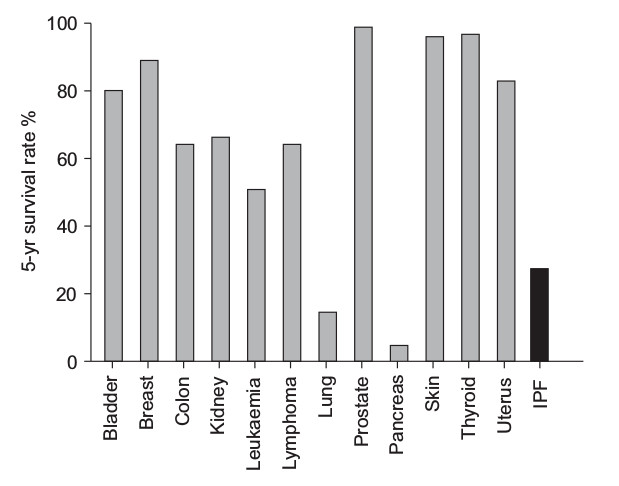
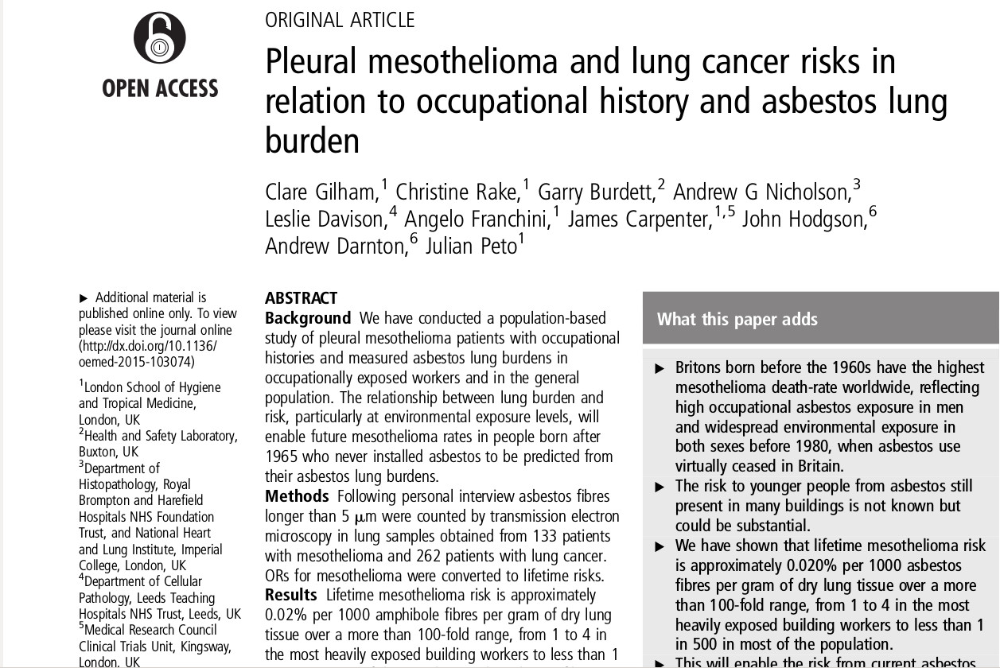
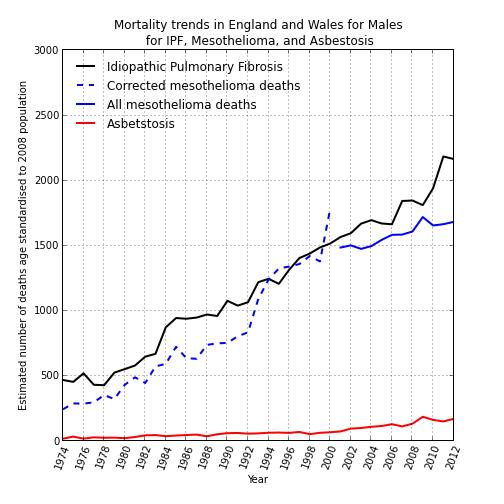
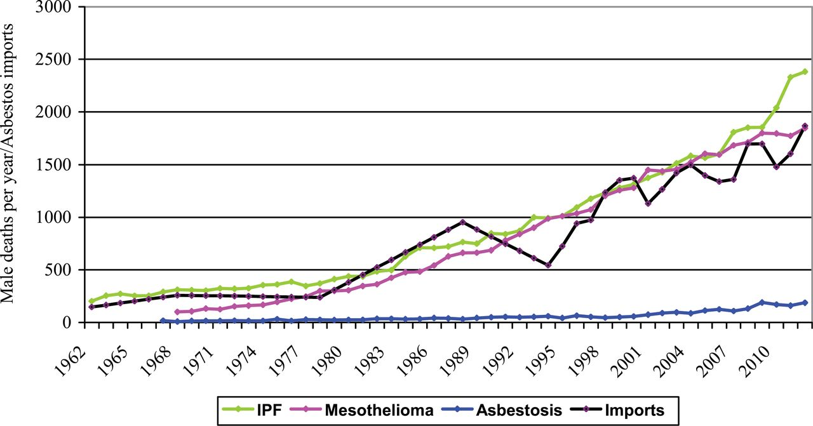

% IPFJES Site Initiation Visit
% Dr Carl Reynolds and Miss Rupa Sisodia

# Idiopathic Pulmonary Fibrosis Job Exposures Study 

##
this talk is available online 

> [http://carlreynolds.net/ipfjes-siv](http://carlreynolds.net/ipfjes-siv)

this studies documentation is available online

> [https://github.com/drcjar/ipfjes/blob/master/README.md](https://github.com/drcjar/ipfjes/blob/master/README.md)

# Today we will cover why, what, and how

## Why are we doing IPF JES?

##

- It's bad to not know the cause of a killer disease that is becoming more common
- There is ongoing asbestos exposure globally (including the UK) 
- There is reason to think some IPF is due to asbestos, potentially we can better understand and prevent IPF

## IPF causes significant morbidity and mortality

##

- c.4000 deaths in 2012 for England \& Wales
- median survival of three years; worse than several cancers
- more common in men, manual workers, those living in industrial regions
- incidence increasing 5\% pa since 2000; don't know why

## 

{ width=65% }

## Asbestos related disease remains a problem

##

- 2 million metric tons per year of asbestos consumed per year
- 125 million people around the world work in environments in which they are exposed to asbestos
- 107,000 people die from occupational exposure to asbesotos / year

## 

# There is reason to think some IPF is due to asbestos

## 

- Clinical Plausibility 
- Observed epidemiological patterns
- Fibre studies and existing case-control data

##

- Clinical presentation can be similar
- Radiologically and histopathologically both give rise to UIP - no differentiating biomarkers
- Doctors may not elicit previous asbestos exposure and patients may not recall it; unclear what dose is needed

## 

##

## 

# Previous studies 

##

- 14 case-control studies to date 
- 8 find an association with metal dust; 4 with wood; 2 with stone
- Most use community controls and self-reported exposure measures; none quantify asbestos exposure
- Occupational overlap with mesothelioma case-control studies
- (meta-analysis and analysis of occupational data from Navaratnams 2014 study - unpublished)

# What we're doing 

## 

- (another) hospital-based case-control study
- lifetime occupational histories combined with occupational proportionate mortality ratios for mesothelioma and a job-process based asbestos exposure assessment..
- blood test for susceptibility genetics to investigate gene-exposure interactions
- basically a telephone-interview + blood test for 920 patients at 16 centres
  
# How IPF JES works

##

- Funded by Wellcome Trust and in the NIHR portfolio. All regulatory approvals in place.

##

- Central research team: full-time clinical research fellow + research assistant, supervised by Prof Cullinan, Chris Barber, and Sara De Matteis. Advisory board of the great and the good. Study management and coordination + one site locally.

##

- Local research centres: PI + research nurse. Identification and recruitment of cases and controls.

##

- All the study documents are online [https://github.com/drcjar/ipfjes/blob/master/README.md](https://github.com/drcjar/ipfjes/blob/master/README.md)

## Local centres identify and recruit participants

## Key documents && events

##

- [The SOP](https://github.com/drcjar/ipfjes/blob/master/ipfjes-sop.pdf)
- [The bundle](https://github.com/drcjar/ipfjes/blob/master/ipfjes-bundle.pdf)
- The box with blood and [CRF](https://github.com/drcjar/ipfjes/blob/master/ipfjes-crf.pdf)
- The email with name and research ID

## What's in the SOP

##

- how to identify cases and controls
- how to recruit them
- how to record the process and communicate with us

## identifying cases and controls

##

- men with an incident diagnosis of IPF from Feb 2017 - Oct 2019 from the ILD clinic
- (age-matched) men without a diagnosis of IPF from not-the-ILD-Clinic
- never worked abroad

## Selecting not-the-ILD-Clinic

##

- randomly selected 
- using a list of all clinics / services / consultants / clinic locations and times
- we're not rigid about how as long as it's 'fair', we're happy to support
- local team asks the clinic lead if its ok to recruit from their clinic, if it's not then we select again

## Recruiting cases (and controls) from clinic

##
- Record number of eligible participants
- Record number of eligible participants approached who refuse to participate
- Complete case-report form for participants + take or arrange blood sample collection
- Post case-report form and blood samples to us in the provided prepaid Royal Mail specimen box
- Email us about the number of eligible participants, number of refusals, and the research ID and name of the samples you're sending us

## on research IDs

##
- used to label samples and the [CRF](https://github.com/drcjar/ipfjes/blob/master/ipfjes-crf.pdf)
- together with recruitment and tissue tracking clinic email allows us to telephone people
- 6 integers, first 2 integers identify centre, remaining four integers allocated however you like (as long as no duplicates)

## What's in the bundle

##

- [participant information sheet](https://github.com/drcjar/ipfjes/blob/master/ipfjes-pis.pdf) (contains enough information for a competent person to consent someone for the study)
- [consent form](https://github.com/drcjar/ipfjes/blob/master/ipfjes-consent.pdf)
- [case report form](https://github.com/drcjar/ipfjes/blob/master/ipfjes-crf.pdf)
- [job history sheet](https://github.com/drcjar/ipfjes/blob/master/ipfjes-jobs.pdf)

# Any questions?

##

- <carl.reynolds@imperial.ac.uk> | <r.sisodia@imperial.ac.uk>
- [drcjar](https://twitter.com/drcjar) | [ipfjes](https://twitter.com/ipfjes)
- [www.carlreynolds.net](http://carlreynolds.net/) | [www.ipfjes.org](http://ipfjes.org/)

